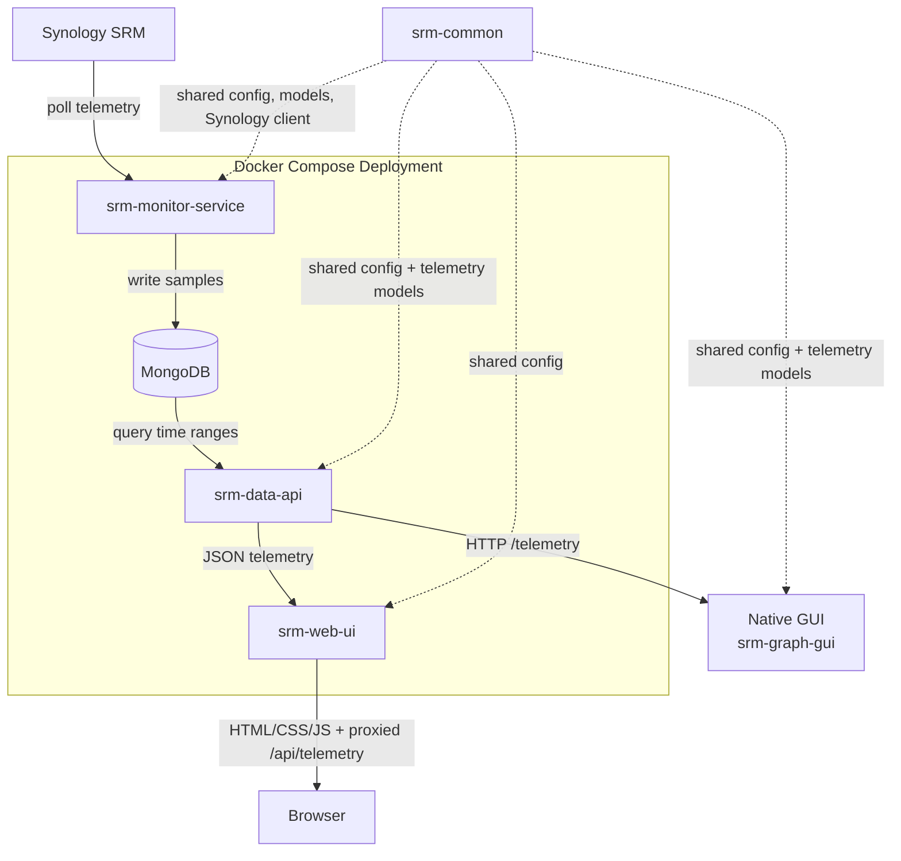

# srm-monitor

Workspace for three independent SRM telemetry applications backed by a shared Rust library.

## Applications

- `srm-monitor-service`: polls Synology SRM and writes telemetry samples into MongoDB.
- `srm-data-api`: serves telemetry samples from MongoDB over HTTP as JSON.
- `srm-web-ui`: serves a responsive browser dashboard and proxies telemetry requests to the API.
- `srm-graph-gui`: native `wgpu` GUI that queries the HTTP API and plots the returned data.
- `srm-common`: shared library for config loading, Synology API access, and telemetry models.

Each runnable application can compile and run independently.

## Component Diagram



## Layout

```text
srm-common/
srm-monitor-service/
srm-data-api/
srm-web-ui/
srm-monitor/
```

## Configuration

There are two distinct config flows in this repository:

- Local native runs with `cargo run -p ...` use crate-local TOML files under each app's `config/` directory.
- Docker deployment does not use those local TOML files. The Compose stack is driven from the repo-root `.env`, and each container writes its own in-container config file at startup.

Example TOML files are committed for local native runs, while the real local `.toml` files are gitignored.

- `srm-monitor-service/config/service.example.toml`
- `srm-data-api/config/api.example.toml`
- `srm-web-ui/config/web.example.toml`
- `srm-monitor/config/gui.example.toml`

Default runtime config paths:

- `srm-monitor-service/config/service.toml`
- `srm-data-api/config/api.toml`
- `srm-web-ui/config/web.toml`
- `srm-monitor/config/gui.toml`

When launched from the workspace root with `cargo run -p ...`, each application resolves its default config relative to its own crate directory.

Optional environment variables can override those paths:

- `SRM_MONITOR_SERVICE_CONFIG`
- `SRM_DATA_API_CONFIG`
- `SRM_GRAPH_GUI_CONFIG`

For the GUI, `history_start` is the oldest timestamp the client will request from the API. On startup it loads the most recent five minutes, and after that it keeps only the currently displayed time range in memory. Pan or zoom to a different range and the GUI requests that range from the API instead of caching full history locally.

## Docker Compose

The repository includes [docker-compose.yml](docker-compose.yml) to start MongoDB, the monitor service, the data API, and `srm-web-ui` together.

For Docker deployment, you do not need to create or edit any of the crate-local `config/*.toml` files. The intended deployment flow is:

```bash
git clone <repo>
cd srm-monitor
cp .env.example .env
# edit .env
docker compose up -d
```

In the deployment-oriented Compose setup, only the web UI is published on the host. MongoDB and the data API stay internal to the Compose network.

For backend plus browser deployment, the only file you need to edit is a local `.env` copied from [.env.example](.env.example). That file is gitignored and only needs these values:

- `SRM_SYNOLOGY_USERNAME`
- `SRM_SYNOLOGY_PASSWORD`

To start the backend stack and then launch the native GUI with one command, run:

```bash
./scripts/start-gui-stack.sh
```

The launcher will:

- read Synology credentials from `.env`
- start Docker Compose for MongoDB, the monitor service, and the API
- apply a temporary local override that publishes the API on `127.0.0.1:6081` for the native GUI only
- wait for the API to answer on `http://127.0.0.1:6081`
- create `srm-monitor/config/gui.toml` if it does not already exist
- launch `cargo run -p srm-graph-gui`

By default, when the GUI exits, the launcher also stops the compose stack. Pass `--keep-backend` if you want the containers left running after the GUI closes.

Deploy or refresh the stack after a `git pull`:

```bash
cp .env.example .env
docker compose up -d
```

After the first copy, later updates only need:

```bash
git pull
docker compose up -d
```

Stop the stack:

```bash
docker compose down
```

The browser dashboard will be available at `http://127.0.0.1:6080` on the host. The API and MongoDB are kept internal to the Compose network during normal deployment.

MongoDB keeps a one-week rolling retention window for telemetry documents via a TTL index on `timestamp_utc`. That same single-field index is used for the API's time-range queries.

## Run

Start the Mongo writer:

```bash
cargo run -p srm-monitor-service
```

Start the HTTP API:

```bash
cargo run -p srm-data-api
```

Start the browser dashboard:

```bash
cargo run -p srm-web-ui
```

Start the GUI:

```bash
cargo run -p srm-graph-gui
```

The browser dashboard proxies `/api/telemetry` to the API and is designed to work cleanly on both desktop and mobile layouts.
It defaults to a 12-hour history window in the browser and lets the user switch between 5 minutes, 1 hour, 12 hours, 1 day, and 1 week.
The native GUI queries `/telemetry` with RFC3339 `start` and `end` parameters and renders the JSON response.

## Development

Format:

```bash
cargo fmt --all
```

Test:

```bash
cargo test
```